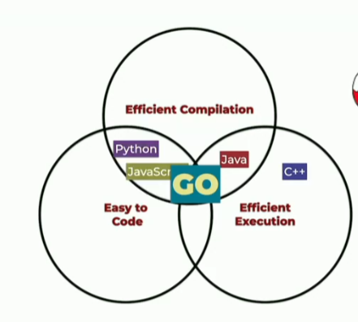

# Basic concepts

- It's an open source language and it's not a GOogle's product
- It's a multi-purpose language
- It's a multi-platform language
- Go was announced to the public in 2009
- When Java was created the web wasn't a big thing yet

## Go philosophy

- Developers shouldn't be making a lot of decisions about how they write the code
- Simplicity
- Language

## Comparision with other languages

- Languages like Java and C# takes minutes or hours to compile the code
- To better scale something you need efficient execution



## Characteristics

- Strong, static type system
- c-inspired syntax
- compiled
- multi-paradigm (object or functional?? it's up to you)
- garbage-collected
  - garbage collector it's like a separeted process that it's looking into your memory
  and if there's a spece in that memory that no one it's pointing then the garbage collector deletes it.
- fast
- single binary compilation

--> In Go 1.x every new version is fully compatible with the previous ones unless there's a security problem.

Go documentation is available [here](https://go.dev/doc/effective_go)

## Go Rules

1. Every file must be within a package (package is something like a folder)

2. Package Naming: Package names should be concise, lowercase, and meaningful. They should reflect the purpose or content of the package. Avoid using generic names like "util" or "common" unless absolutely necessary.

3. File Naming: Go files should have names that reflect the main entity or purpose of the code within them. For example, a file containing HTTP handler functions might be named handlers.go, while a file containing database-related code might be named database.go.

4. Code Formatting: Go code should be formatted according to the conventions outlined in the official Go formatting guidelines (gofmt). This ensures consistency and readability across different codebases.

5. Imports: Imports should be organized and grouped logically. Standard library imports should come before third-party package imports, and local package imports should come last. Unused imports should be avoided and removed.

6. Variable Naming: Variable names should be descriptive and follow camelCase convention. Short variable names like i, j, or tmp should be avoided unless their scope is extremely limited (e.g., loop counters).

7. Commenting: Code should be adequately commented to explain its purpose, especially for complex logic or non-obvious behavior. Comments should be clear, concise, and written in complete sentences.

8. Error Handling: Errors should be handled explicitly and not ignored. Use the error type or custom error types to represent errors, and handle them gracefully using if err != nil constructs or similar error-checking mechanisms.

9. Concurrency: When writing concurrent code, prefer the built-in concurrency primitives provided by Go (goroutines and channels) over lower-level synchronization mechanisms like mutexes and condition variables. Use channels for communication and synchronization between goroutines.

10. Testing: Write comprehensive unit tests for your code using the standard Go testing framework (testing). Tests should cover both normal and edge cases, and should be kept up-to-date with changes to the codebase.

11. Documentation: Package-level and function-level documentation should be provided using Go's built-in documentation comments (//). Document the purpose, parameters, return values, and any relevant usage examples for each exported entity.

12. Avoid Global State: Minimize the use of global variables and mutable global state, as they can lead to unexpected behavior and make code harder to reason about. Instead, prefer dependency injection and explicit parameter passing.

## Multi-platform

- It can generate executable binary files for different operating systems: Windows, Linux, MacOS, etc.
And different platforms: x86, ARM.
- Go can compile to WebAssembly(WASM) which is a binary format that runs in the browser. WebAssembly is used for games on the web, compression/decompression, cryptography and cryptocurrencies, for example. Also, it has been used for machine learning.
- GO can transpile to JavaScript. So it can be used in the front-end.dd

List of Operating Systems and platforms that Go can compile in this [link](https://golang.org/doc/install/source#environment)

- By default, Go compiles to the platform that you are using. If you want to compile to another platform you need to specify it.
```	
GOOS=linux GOARCH=amd64 go build -o myapp
```

## Common use cases for Go

- Web servers
- APIs
- CLI tools
- DevOps tools
- Distributed systems
- Cloud services
- Machine Learning
