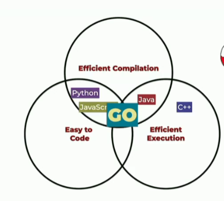

# Basic concepts

- It's an open source language and it's not a GOogle's product
- It's a multi-purpose language
- It's a multi-platform language
- Go was announced to the public in 2009
- When Java was created the web wasn't a big thing yet

## Go philosophy

- Developers shouldn't be making a lot of decisions about how they write the code
- Simplicity
- Language

## Comparision with other languages

- Languages like Java and C# takes minutes or hours to compile the code
- To better scale something you need efficient execution

## Characteristics

- Strong, static type system
- c-inspired syntax
- compiled
- multi-paradigm (object or functional?? it's up to you)
- garbage-collected
  - garbage collector it's like a separeted process that it's looking into your memory
  and if there's a spece in that memory that no one it's pointing then the garbage collector deletes it.
- fast
- single binary compilation

--> In Go 1.x every new version is fully compatible with the previous ones unless there's a security problem.

Go documentation is available [here](https://go.dev/doc/effective_go)

## 